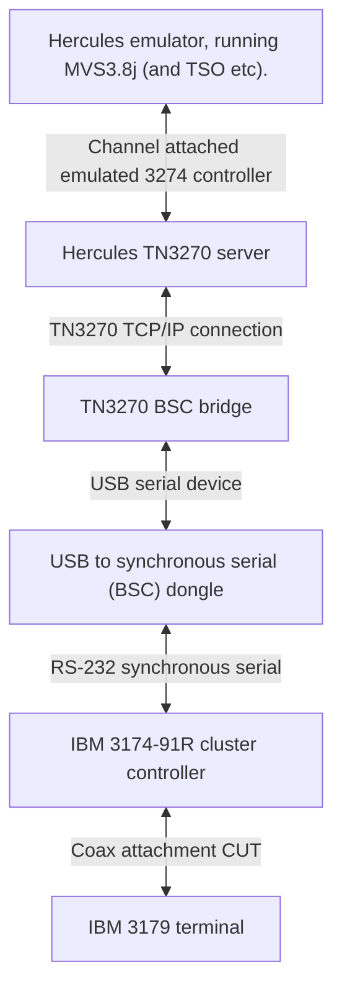

TN3270 to BSC bridge
--------------------

This is a work in progress and is not functional at this point.

## Introduction

This is all about my attempt to connect a real IBM 3174 cluster controller to the Hercules-390 emulator, running
MVS3.8J (TK4-). I started with an idea to use SDLC communications to my 3174-91R controller, but decided to
try a path of lesser resistance so I wouldn't have to deal with the SNA protocol.

The idea here is to create use this software to write and read BSC frames to a USB attached dongle (looking as a basic serial port) that then writes the data to a synchronous RS-232 interface.

The USB to serial dongle is based around an Arduino board and uses MAX232 ICs to shift voltage levels as required
for RS-232/V.24 comms. The serial interface is synchronous, meaning there are clock signals for the transmit and
receive data.

This project, the TN3270 BSC bridge is (or will be) responsible for --

* Framing the 3270 datastream, received from the TN3270 server
* Sending BSC frames to the dongle
* Interpreting ACKs/NAKs that come back from the dongle
* Sending poll requests to the devices
* Receiving BSC frames from the dongle and returning 3270 responses to the TN3270 server.

