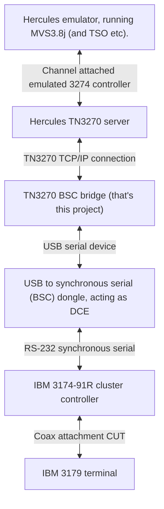

TN3270 to BSC bridge
====================

This is a work in progress and is not functional at this point.

## Introduction

This is all about my attempt to connect a real IBM 3174 cluster controller to the Hercules-390 emulator, running
MVS3.8J (TK4-). I started with an idea to use SDLC communications to my 3174-91R controller, but decided to
try a path of lesser resistance so I wouldn't have to deal with the SNA protocol.

The idea here is for this software to write and read BSC frames to a USB attached dongle (attached as a basic serial port) that then writes the data to a synchronous RS-232 interface.

The USB to serial dongle is based around an Arduino board and uses MAX232 ICs to shift voltage levels as required
for RS-232/V.24 comms. The serial interface is synchronous, meaning there are clock signals for the transmit and
receive data.

This project, the TN3270 BSC bridge is (or will be) responsible for --

* Establish a TN3270 session for each device (real or logical terminal) attached to the 3174.
* Framing the 3270 datastream, received from the TN3270 server
* Sending BSC frames to the dongle
* Interpreting ACKs/NAKs that come back from the dongle
* Sending poll requests to the devices
* Receiving BSC frames from the dongle and returning 3270 responses to the TN3270 server.

## Why is this in Javascript?

In my professional paid work, I have been developing mostly back-end code in Javascript. As this is what I'm
currently working with, and I haven't done any C# or Java for a little while, Javascript was comfortable for me.
C and C++ are even longer ago if I don't count the small amount I've been doing for the Arduino USB to BSC dongle.
I may well decide to convert this code to another language at some time in the future.

## What's working (as of 7/23/2022)

At this time, not too much.

* The TelnetConnection class (and the TelnetOptionSet and TelnetOption classes) are mostly operational.
  These classes allow a connection to be made to the telnet (TN3270) server and receive the initial 3270 datastream that is sent down from MVS/TSO.

## CRC calculations

I have found that the npm `CRC` module with function `crc16` appears to give the expected BCC values for BSC.

## Other ideas

I have a second IBM 3174, a model 51R. Perhaps I will try and attach this using SNA.

Another device that I have, is a INFORMER terminal, a SDLC/SNA variant. So it's pretty much the same as the above 3174 for getting this working. I think it is possible to use the V.24 port directly. If not, I do have a
couple of SDLC capable synchronous modems.

