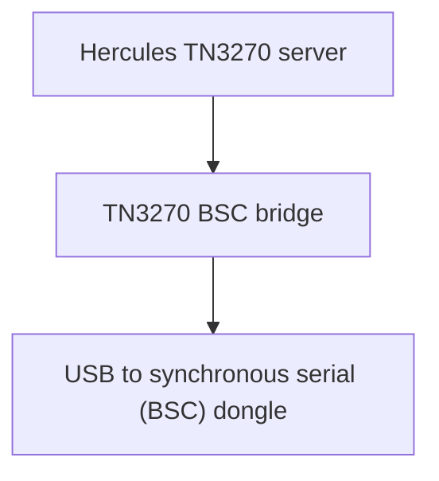

TN3270 to BSC bridge
--------------------

This is a work in progress and is not functional at this point.

## Introduction

This is about my attempt to connect a real IBM 3174 cluster controller to the Hercules-390 emulator, running
MVS3.8J (TK4-).

The idea here is to create use this software to write and read BSC frames to a USB attached dongle (looking as a basic serial port) that then writes the data to a synchronous RS-232 interface.

